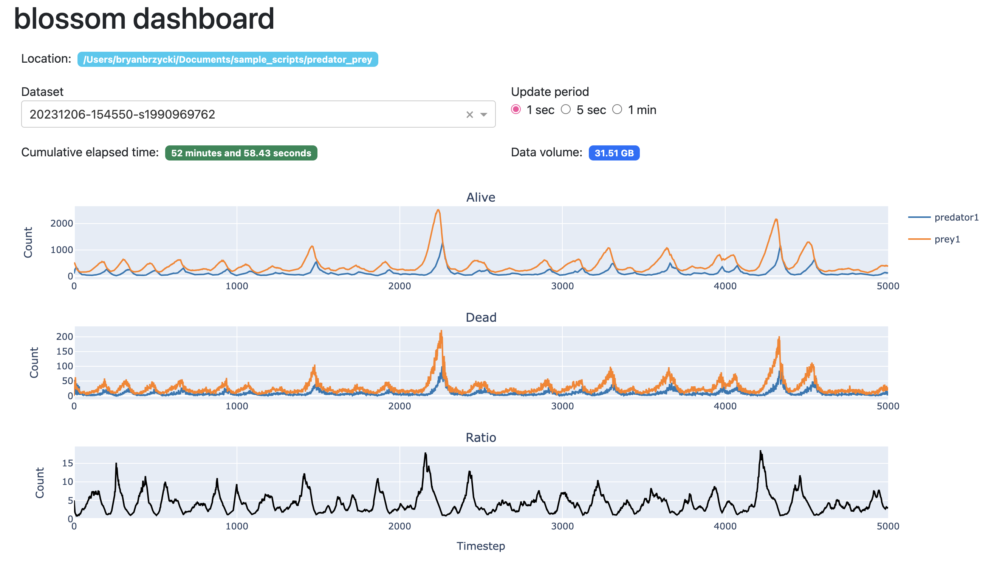

===========
Basic Usage
===========

To start a simulation project, create a new directory to house all custom 
scripts, including a configuration file ``config.yml``. In this config file, you
specify species parameters, including starting population, max age, and action
methods. Some action methods are built-in (for movement, eating, drinking, and
reproduction), but you may use custom methods defined in external Python 
scripts, which are imported at runtime by Blossom via ``linked_modules``. 

World parameters are also specified in the config file, including dimensions 
and the distribution of water and food. You may also set limits on the number
of timesteps and organisms, in order to control the simulation in case of
runaway populations. 

With your project directory set up, you may run the simulation using the 
included command-line interface (CLI):

.. code-block:: bash

    blossom run

Note that for reproducibility, you can set the random seed either in the config
file or at the CLI. For additional options, run ``blossom run -h``. 

Dashboard 
---------

Blossom provides a dashboard that runs in your local browser, tracking the 
progress of your population runs. 

Initiate the dashboard, run 

.. code-block:: bash

    blossom dashboard TRACK_DIR [-p PORT]

where ``TRACK_DIR`` is the simulation project directory. You can then view the 
dashboard at ``localhost:PORT``.

